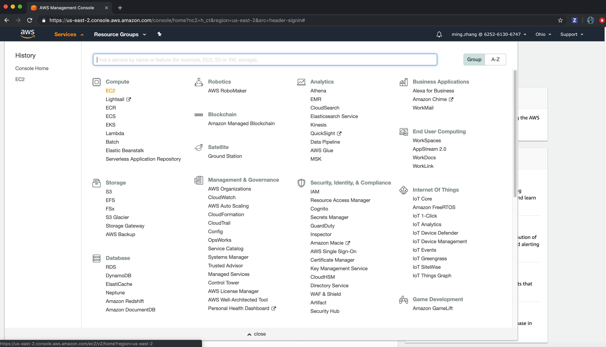
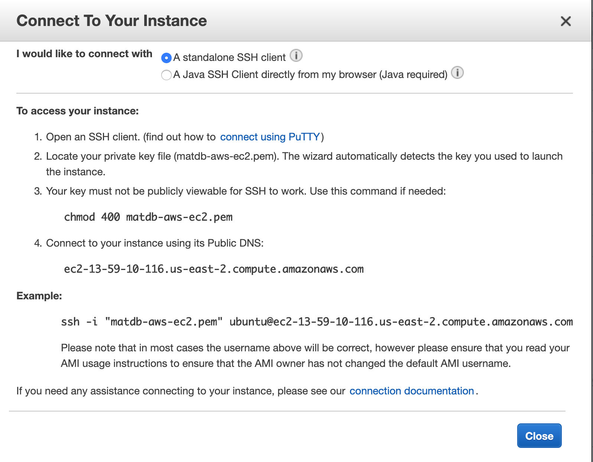

# Tracy MatDB (Materials Database)

Code for generating configuration databases to train interatomic potentials.

The interatomic potentials are created using [MLIP](http://gitlab.skoltech.ru/shapeev/mlip). Which uses [Quantum Espresso](https://gitlab.com/QEF/q-e).

# Table of Contents

We describe the steps to run the project either on a local machine or a remote machine on AWS.

- [Quickstart Summary](#Quickstart-Summery)
- [Build Containers Locally](#Build-Containers-Locally)
- [Running the Project](#Running-the-Project)
- [Remote Run Using AWS](#Remote-Run-Using-AWS)
    1. [Prepare AWS Instance](#Prepare-AWS-Instance)
    2. [Prepare and Upload Images](#Prepare-and-Upload-Images)
    3. [Setup Remote Machine](#Setup-Remote-Machine)
- [Miscellaneous](#Miscellaneous)
    - [API Documentation Generation](#API-Documentation-Generation)
        1. [Dependencies for Generation](#Dependencies-for-Generation)
        2. [Build API Documentation](#Build-API-Documentation)
        3. [Extract from Container](#Extract-from-Container)
    - [Unit Tests](#Unit-Tests)
    - [Intermediate Files](#Intermediate-Files)
    - [Monitoring Tips](#Monitoring-Tips)
    - [Helpful Docker Commands](#Helpful-Docker-Commands)
    - [Contributing](#Contributing)

# Quickstart Summary

The project follows some high-level steps:
- [Build](#Build-Containers-Locally)
- Optional: [Upload](#Remote-Run-Using-AWS)
- [Run](#Running-the-Project)

# Build Containers Locally

<!-- Change URLs when project ownership changes. -->

Clone all the related projects:
- [Tracy Docker](https://github.com/NorimaConsulting/tracy_docker)
- [Tracy MatDB](https://github.com/NorimaConsulting/tracy_matdb)

Use `ssh` or `https` at your convivence. It is *recommended* that they be in a folder that makes it easy for you to find. It is **required** that the cloned projects be siblings of one another.
- If you plan to use `ssh` keys, there is a good guide from [github](https://help.github.com/en/articles/adding-a-new-ssh-key-to-your-github-account).

The resulting folder structure should look as such:

```
tracy_root
├── tracy_docker
└── tracy_matdb
```

Follow the instructions in the [Tracy Docker readme](https://github.com/NorimaConsulting/tracy_docker/blob/master/README.md) to build all relevant prerequisite docker images.

To verify, run `docker images`. You should see a similar output to below:
```
REPOSITORY          TAG      IMAGE ID     CREATED      SIZE
mlip4tracy          latest   ...          ...          1.98GB
pslibrary4tracy     latest   ...          ...          6.56GB
dft_qe4tracy        latest   ...          ...          2.43GB
ubuntu4tracy        16.04    ...          ...          1.54GB
ubuntu              16.04    ...          ...          119MB
```

You may see more images, but the above should be present.

We can now build the `MatDB` image. Using a shell of your choice go into the `tracy_matdb` directory and run the `build_docker_image.sh` script to build the `MatDB` image. Note that this image builds on top of `mlip4tracy`.

Now you can either run them locally, or on AWS.

# Running the Project

Some optional tips, you may want to use a terminal multiplexer like `tmux`. We have found it useful, especially if the host machine is remote.

Run the docker image with:
```bash
docker run -it --rm matdb /bin/bash
```

At this point you need to provide a `yml` file or use the example one. The format of the `yml` file is specified in the API Documentation (which must be first generated before viewing).

Then within the instance:
1. Move the `/root/codes/` directory
2. Run `./mtp_train.sh <yml-file-location>`
    - If you do not specify a `yml` file location then MatDB will run based off the example `yml` file.
    - Note that the scripts run cell sizes of 3 or 4 runs until the `mtp` file has converged suitably, then increases the cell size.
    - The specification is found in the API documentation.
        - The API documentation must be generated and instructions can be found [here](#API-Documentation-Generation).

# Remote Run Using AWS

## Prepare AWS Instance

1. Login to your AWS management console.
2. Tap EC2 to get into "resources" screen, then select "running instances".
    - 
3. Now tap "launch instance", then follow the steps to create new AWS EC2 instance.
    1. **Choose AMI**: You can choose any Linux image that you prefer, the screenshot provided demonstrates one such choice. We recommend the use of *Amazon Linux AMI* using 64 bit (x86).
        - 
    2. **Choose an Instance Type**:
        - A minimum requirement of 8 gb of memory.
        - Choose the other options as you see fit.
    3. **Configure Instance**
        - Do not change unless you have specific needs.
    4. **Add Storage**:
        - A minimum of 50 GB of hard drive space.
            - This value depends on the number of computations you wish to run.
    5. **Add Tags**:
        - Do not change unless you have specific needs.
    6. **Configure Security Group**:
        - Do not change unless you have specific needs.
    7. **Review**:
        - Double check that all the values are as you expect.
    8. Click **Launch**, and you should be taken to define a key pair.
        - You have the option to:
            - Create a new key pair
                - Doing so creates a new one, then allows you to download the private key. Once you move away from that page, the private key can no longer be accessed. If you lose it, you must create a new one.
            - Choose a key pair name
                - You can use a pre-existing key if you have previously used any. Note that if you do not have the associated private key, you will not be able to remotely access the machine.
        - 
4. Now launch the instance. Then you will see your newly created instance. Now you are able to use your pem file to connect to your EC2 instance.
    - 


**Note**: The jar files is about 15G, it also occupied about 15G as docker images, so you need at least 30G to generate these docker images and save to local disk.
On EC2 you also need at least 30G space to host the jar files and docker images at first, although you can delete the jar files later.
Also, make sure the compute folder and its subfolder are correctly created before running `mtp_build.sh`.


## Prepare and Upload Images

Note for this step, your local machine requires sufficient hard drive space (minumum 50GB).

```bash
➜ cd tracy_matdb/scripts/deploy
➜ ./deploy.sh # this extracts the required images as jar files
```

Then you can upload the `.jar` files to the remote machine.

Within the `tracy_matdb/scripts/deploy` folder run the following command:
```bash
➜ IDENTITY_FILE="<somepath>/tracy-science-test-001.pem" \
    DESTINATION_URL="ec2-user@<ec2-id>.<region>.compute.amazonaws.com" \
    DESTINATION_PATH="~/" \
    ./deploy_aws.sh
```
- Note that in line definitions of environment variables don't leak out into outer name space. Which is great!
Fill in the above information to facilitate a connection to your remote AWS instance. If your `DESTINATION_URL` format differs, just use the one you are give from the `AWS` console.

## Setup Remote Machine

First you need to make sure that `docker` is installed.

If it isn't, the command depends on the package manager on your system. The following are examples with `yum` and `apt`.
```bash
➜ sudo yum -y install docker
```
```bash
➜ sudo apt-get install docker
```

Next you need to make sure that the `docker-service` is running.

```bash
➜ sudo service docker start
```

Then load the docker images into docker service. The files and script should be in the `$HOME` directory if following previous steps.
```bash
➜ cd $HOME
➜ ./load_docker_images_aws.sh
```

After the images are loaded, you can run the project following the steps in the [run section](#Running-the-Project).

# Miscellaneous

## Build Documentation

### Dependencies for Generation

Install the dependencies:
- `python3 -m pip install git+https://github.com/sphinx-doc/sphinx`
- `python3 -m pip install sphinxcontrib-napoleon`

### API Documentation Generation

Move to the `tracy_matdb/docs` directory. Then run `make` to see what format you want to make the documentation as.
    - To create an `html` version run `make html`.

The following is an example:
```bash
➜ cd tracy_matdb/docs
➜ make html
```

### Extract from Container

You want to extract the relevant files in the `_build` directory that was recently generated.

You can use `docker cp` to extract them from inside a docker image.
```bash
➜ docker cp <container-id>:/root/codes/matdb/docs/_build <host-destination>
```
- The `<container-id>` can be found using `docker ps`.
- `<host-destination>` is a file location on your local machine in which you want to place the files.

The extracted files can then be viewed. If you created an `html` version, you can open `<host-destination>/_build/html/index.html` in your web browser of choice.

## Unit Tests
From within an instance of the docker image `MAtDB` run the following:
```bash
➜ python3 -m pytest /root/codes/matdb/tests
```

To run the tests with a code coverage tool:
- Install `pytest-cov` with `python3 -m pip install pytest-cov`.
Then to run the unit tests with the coverage tool:
```bash
➜ python3 -m pytest --cov=/root/codes/matdb /root/codes/matdb/tests
```

## Intermediate Files

- `to-relax.cfg`
    - Contains the structures needed to be relaxed. Ideally the IAP should be able to relax all this contained structures. Otherwise, it is added to `new_traning.cfg` which should eventually be added to the training set (`train.cfg`).
    - Generated at the first iteration for each atom cell iteration.
- `new_training.cfg` (`new_training.cfg_iter_?`)
    - Each iteration will generate some new structures which couldn’t be relaxed by the current IAP. These new structures will be added to the training set (`train.cfg`)  at the beginning of the next iteration. A copy of this file is saved for each iteration for debugging purposes.
        - For example: `new_training.cfg_iter_6` is for the 6th iteration. If this file is empty, it means it converged at the iteration this file is corresponding to.
- `train.cfg` (`train.cfg_iter_?`)
    - Configurations of the training set.
    - A copy of this file is saved for each iteration for debugging purposes.
- `pot.mtp` (`pot.mtp_iter_?`)
    - Data for the representation of the moment tensor potential.
    - A copy of this file is saved for each iteration for debugging purposes.
- `training.txt` (`training.txt_iter_?`)
    - The log file for the `mtp train` process.
- `status.txt`
    - Contains status code for each step in an iteration.
    - Some of the status:
        ```python
        "relax_setup {0} {1}".format(self.iter_count, self.cell_iter)
        "relax {0} {1}".format(self.iter_count, self.cell_iter)
        "select {0} {1}".format(self.iter_count, self.cell_iter)
        "add {0} {1}".format(self.iter_count, self.cell_iter)
        "done {0} {1} {2}".format(self.iter_count, self.cell_iter, len(new_configs))
        ```
        - Refer to `command()` method in `fitting.mtp.py` module for a complete status and its meaning.
- `jobfile.sh`
    - Contains `mtp` command to be executed.
    - Each iteration has its own `mtp` commands needed to be carried out.
- `iter_?.pkl` files in `Active` database.
    - The `Active` database resides at `/root/codes/compute/MTP/{$FIT_NAME}/Active/active.{$FIT_NAME}` for our example, `CoWV` structures (which would be `/root/codes/compute/MTP/CoWV/Active/active.CoWV`).
    - Each iteration will have its `pkl` file generated at the `Active` database root directory. Each `pkl` file contains the new structures for the specific iteration. Notice that the number of structures in `new_training.cfg_iter_?` and `iter_?.pkl` should be the same.
        - For example: `new_training.cfg_iter_9` and `iter_9.pkl` should have the same number of structures. But `train.cfg_iter_10` minus `train.cfg_iter_9` might have less structures than in the two files. That is because the QE calculations could fail on some of the new structures.
        - `pkl` file is a python pickle file.
- `matdb/templates/bash_build_ml.sh`
    - This template file is used to generate the `jobfile.sh` in the `Active` database root directory defined above.  This template file works only for `QE` calculation.

## Monitoring Tips

To watch the progress, you can watch the contents and generation of the temporary files in the directory `/root/codes/compute/MTP/${FIT_NAME}/${FIT_NAME}/mtp/`.
- `${FIT_NAME}` is will be a concatenation of the elements that are used.
    - `${FIT_NAME}` is `CoWV` when using the example `yml` file for Cobalt, Tungsten, and Vanadium.

The following snippet can be used in the directory of temporary files to provide useful progress information.
```python
import os
import datetime
max_value=45
seconds_per_hour=60*60
count=dict()
date=dict()
for ii in range(1,max_value+1):
    filename = "train.cfg_iter_{}".format(ii)
    temp = open(filename).read()
    count[ii] = temp.count("BEGIN_CFG")
    date[ii] = os.path.getmtime(filename)
start_time = min(date.values())
print("Iter|NumStrct|DeltaStruct|NumHours|TotalHours|Date")
for ii in range(1,max_value+1):
    print("{:02d} {:5d} {} {} {} {}".format(
        ii,
        count[ii],
        "{:5d}".format(count[ii]-count[ii-1]) if ii > 1 else 5*" ",
        "{:6.2f}".format((date[ii+1]-date[ii])/seconds_per_hour) if ii < max_value else 6*" ",
        "{:6.2f}".format((date[ii+1]-start_time)/seconds_per_hour) if ii < max_value else 6*" ",
        datetime.datetime.utcfromtimestamp(date[ii]).strftime("%m-%d-%H:%M")
    ))
```

Example output of the above snippet:
```
Iter|NumStrct|DeltaStruct|NumHours|TotalHours|Date
01    20         9.52   9.52 05-17-05:22
02   318   298  11.86  21.38 05-17-14:53
03   581   263   9.34  30.72 05-18-02:45
04   846   265  12.03  42.75 05-18-12:05
05   986   140  12.86  55.61 05-19-00:06
06  1163   177   8.61  64.22 05-19-12:58
07  1302   139   8.02  72.24 05-19-21:35
08  1345    43   7.42  79.66 05-20-05:36
09  1390    45   7.02  86.68 05-20-13:01
10  1437    47   5.96  92.64 05-20-20:02
11  1448    11   8.10 100.75 05-21-02:00
12  1468    20   7.06 107.81 05-21-10:06
13  1508    40   6.26 114.07 05-21-17:10
14  1535    27   6.33 120.39 05-21-23:26
15  1545    10   6.57 126.97 05-22-05:45
16  1547     2   6.76 133.73 05-22-12:20
17  1552     5   6.37 140.10 05-22-19:05
18  1556     4  11.80 151.90 05-23-01:27
19  1556     0   9.38 161.28 05-23-13:15
```

## Helpful Docker Commands

Depending on how `docker` is installed, you made need to run commands with `sudo`.

Stop all running containers
```bash
docker stop $(sudo docker ps -a -q)
```

Remove all docker images
```bash
docker rmi $(docker image ls -a  --format  "{{.ID}}")
```

Remove stop all containers and remove unused images
```bash
docker system prune
```

Create a second connection to an existing container
```bash
➜ docker exec -it <container-id> /bin/bash
```
The container ID can be found using `docker ps`

## Contributing

Before contributing to `MatDB` please read the [contributing guidelines](/CONTRIBUTING.md).
