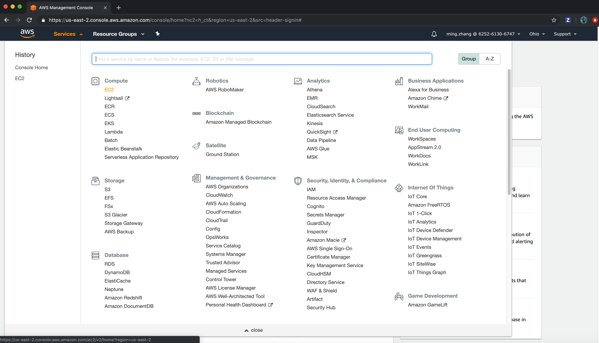
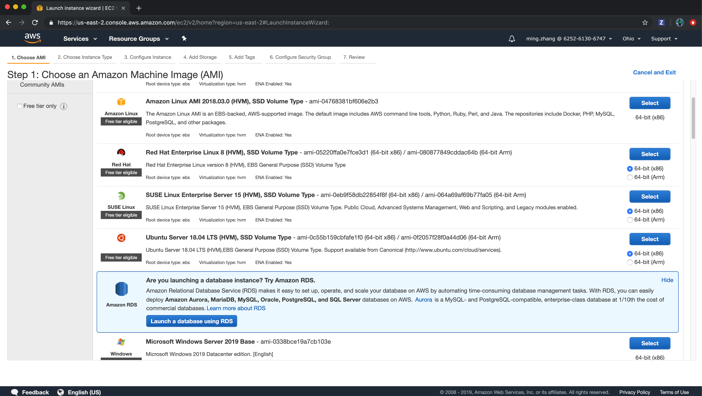
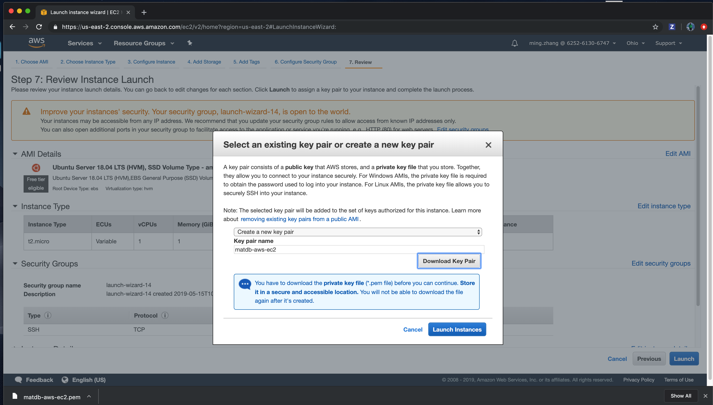
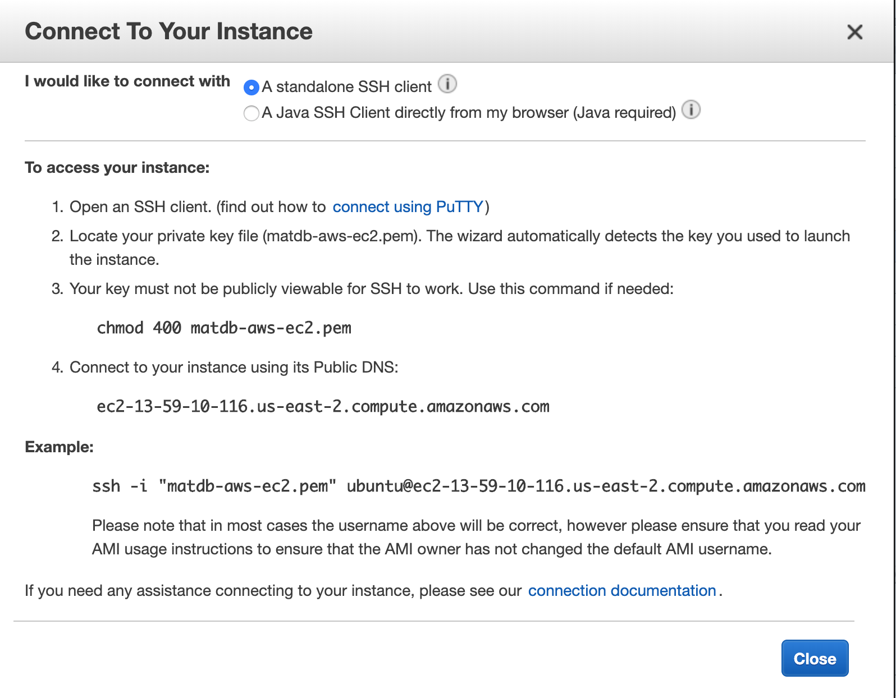

# AWS Deployment Documentation:
# EC2 Instance Creation and How to Connect

1. Login to your AWS management console.
2. Tap EC2 to get into Resources screen, then select Running Instances, as show in this screenshot: 
3. Now Tap Launch Instance, then follow the steps to create new AWS EC2 instance:
4. At the end of step "Review Instance Launch", create a new key pair, choose a key pair name, for example: matdb-aws-ec2, then tap "Download key Pair", you will have a pem file matdb-aws-ec2.pem stored to your local machine.
5. Now Launch Instance. Then you will see you newly created instance
6. Now you are able to use your pem file to connect to your EC2 instance. 

# Deploy matdb and dependency docker images to AWS EC2 instance.

Before running the steps, please download your .pem file for accessing your EC2 instance.
1. On your local machine, build all the docker images with the following steps:
  1. master dependencies images:
    ```bash
      cd tracy_docker_norima/ubuntu16.04
      ./build_docker_images.sh
    ```
  2.  build mtp images:
    ```bash
      cd tracy_science_norima/mtp
      ./build_docker_image.sh
    ```
  3. build matdb images:
    ```bash
      cd tracy_matdb_norima
      ./build_docker_image.sh
    ```
2. under this tracy_deploy foler:
  ```bash
    ./deploy.sh  # this will save all your docker images to .jar files
    ./deploy_aws.sh  # this will copy all jar fils to your EC2 instance
    # login to your EC2 console described in the step in first section, then run
    ./load_docker_images_aws.sh  # this will load all those jar files to docker
    # note: if you don't have docker installed in EC2, run this command to install docker first
    sudo apt-get install -y docker-ce
  ```
3. Now you can run the matdb with below steps:
  ```bash
    docker run -it matdb_stable /bin/bash
    docker exec -it <container name> /bin/bash  -- to open another Shell to monitor
  ```
 1. Remove the `~/compute` folder.
 2. Recreate the folder `mkdir -p ~/compute/MTP/CoWV`
 3. Run `mtp_build.sh` once
 4. Run `mtp_train_first_iter.sh` once
 5. Run `mtp_train_second_iter.sh` repeatedly until converge.

**Note**: The jar files is about 15G, it also occupied about 15G as docker images, so you need at least 30G to generate these docker images and save to local disk.
On EC2 you also need at least 30G space to host the jar files and docker images at first, although you can delete the jar files later.
